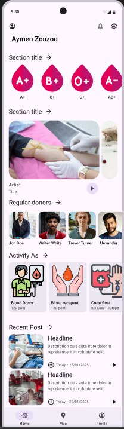

# Task 2: Implement the First UI in view/MainScreen

## Code Explanation

The codebase is structured around the Ahyaha application using **MVVM Architecture**. Here are the key components:

1. **DonorViewModel**: Handles the business logic related to donors.
2. **MainActivity**: Acts as the entry point of the application.
3. **MainScreen**: Composable that displays the UI, including the list of donors.
4. **DonorRepository**: Acts as a repository for donors.
5. **BloodTypeRepository**: Manages blood type data.
6. **Donor Model & Blood Type Model**: Define the data structure for donors and blood types.

## Task

Your task is to implement the first UI in `view/MainScreen` based on the design provided in `FirstUI.jpg`. The UI should include:

- A list of donors.
- A navigation bar.
- A donor detail view when a donor is selected.
- A search bar to filter donors by name or blood type.

### Additional Requirements

1. **Add More Donors and Blood Types**:
   - Add at least 5 more donors to the mock data in `DonorRepository.kt`.
   - Ensure the new donors and blood types are displayed in the UI.

2. **Implement Search Functionality**:
   - Add a search bar to the top of the `view/MainScreen` UI.
   - Implement functionality to filter the donors list based on the search query (e.g., by donor name or blood type).

## Instructions

1. Open `view/MainScreen.kt`.
2. Implement the UI layout in `view/MainScreen`.
3. Use the `DonorViewModel` to fetch and display donors.
4. Ensure the UI matches the design in `FirstUI.jpg`.

## FirstUI

Good luck!
